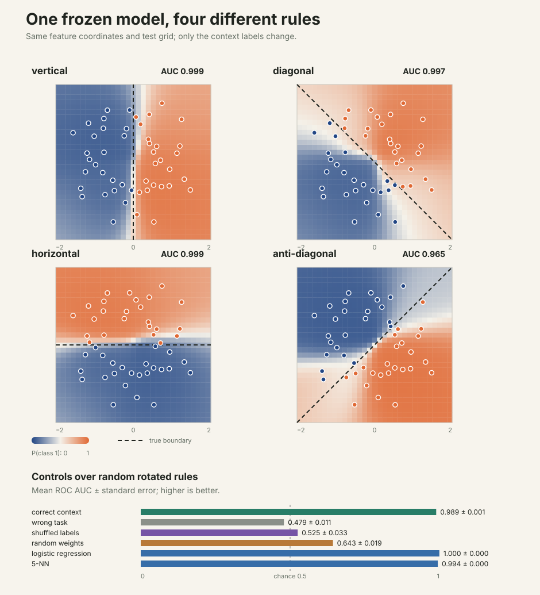
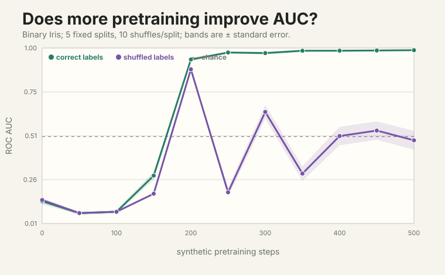

# microTabICLv2

A **one-file**, educational implementation of
[TabICLv2](https://arxiv.org/abs/2602.11139). It trains from scratch on a tiny
synthetic prior, runs on a Mac, and can use the same file on Modal GPUs.

Like [microTabPFN](https://github.com/jxucoder/microtabpfn), the goal is to make
the idea readable—not to reproduce the official pretrained model or its compute
budget.

## Quick start

Install [uv](https://docs.astral.sh/uv/), then run the whole experiment:

```bash
uv sync --extra dev
uv run python microtabiclv2.py --steps 500 --device auto
```

That single command:

1. trains on synthetic tabular tasks;
2. measures binary-Iris AUC every 50 steps;
3. compares correct and shuffled context labels;
4. tests four context-defined decision rules; and
5. saves a reusable checkpoint.

Add `--svg-dir evaluations` to regenerate the figures. Use `--load
checkpoints/microtabiclv2.pt --steps 0` to evaluate without training again.

## The entire implementation

[`microtabiclv2.py`](microtabiclv2.py) contains:

- the correlated nonlinear synthetic prior;
- feature grouping `(0, 1, 3)`;
- early target-aware embeddings;
- induced column attention;
- RoPE row attention and CLS aggregation;
- dataset-wise in-context attention with QASSMax;
- training and checkpoints;
- the sklearn-style classifier;
- AUC and rule-switching proofs; and
- optional Modal functions.

The core model, prior, training loop, and estimator are about 300 lines. The
remaining lines are comments, proofs, dependency-free SVG output, and Modal/CLI
entrypoints.

## How it works

```text
synthetic tasks
      │
      ▼
group neighboring features + add known train labels
      │
      ▼
induced attention over rows inside each feature
      │
      ▼
attention over features inside each row
      │
      ▼
test rows attend to labeled train rows (ICL happens here)
      │
      ▼
class probabilities — no gradient update at inference
```

## Does it really use context?

A benchmark score alone is weak evidence. The rule-switching intervention keeps
the model, feature coordinates, and test grid fixed while changing only the
context labels. The frozen model must produce four incompatible boundaries.



The training trace checks a different claim: does AUC improve as synthetic
pretraining continues, while shuffled-label context stays near chance?



These are demonstrations of real in-context adaptation, not claims of broad
state-of-the-art tabular performance.

One reproducible 500-step run on Apple MPS (seed 42) produced:

| Test | Correct context | Control |
|---|---:|---:|
| Binary Iris AUC | **0.969** | 0.481 with shuffled labels |
| 100 changing linear rules | **0.984** | 0.528 with the wrong rule |

The point is the controlled gap: the weights and test inputs stay fixed, and
only the labeled examples change. Run the quick-start command to reproduce it;
exact values vary with hardware and seed.

## Make it bigger with Modal

The same file exposes two optional Modal functions:

```bash
uv sync --extra modal
uv run modal setup

# L40S / A10 / T4 fallback pool
uv run modal run microtabiclv2.py::modal_small \
  --profile small --steps 5000 --name small

# H100 / A100-80GB fallback pool
uv run modal run --detach microtabiclv2.py::modal_large \
  --profile paper --steps 100000 --name paper
```

Checkpoints persist in the `microtabiclv2-checkpoints` Modal Volume.

| Profile | Width | Blocks (column/row/ICL) | Intended hardware |
|---|---:|---:|---|
| `micro` | 48 | 1 / 1 / 2 | Mac / CPU |
| `small` | 64 | 2 / 2 / 4 | Modal value GPU |
| `paper` | 128 | 3 / 3 / 12 | Modal H100 / A100 |
| `large` | 192 | 4 / 4 / 18 | scaling experiment |

## Limitations

- classification only;
- a tiny SCM/BNN-like prior rather than the full released TabICLv2 prior;
- contexts of tens to hundreds of rows, not the paper's 60K-row curriculum;
- no preprocessing ensemble, KV cache, disk offloading, or official weights;
- educational profiles are not benchmark-equivalent to TabICLv2.

## Paper and code provenance

The implementation was checked against:

- [TabICLv2 paper](https://arxiv.org/abs/2602.11139);
- [official TabICL repository](https://github.com/soda-inria/tabicl), including
  the public v2 pretraining/prior changes merged in PR #135;
- [NanoTabICL](https://github.com/soda-inria/nanotabicl); and
- recent official MPS/device work, which motivated the bias-separated Linear
  layer used here.

## Tests

```bash
uv run ruff check .
uv run pytest
```

The repository intentionally contains one implementation file and one test
file. Generated checkpoints, evaluations, caches, and build artifacts are
ignored.

## License

BSD 3-Clause. TabICLv2 is by Qu, Holzmüller, Varoquaux, and Le Morvan.
