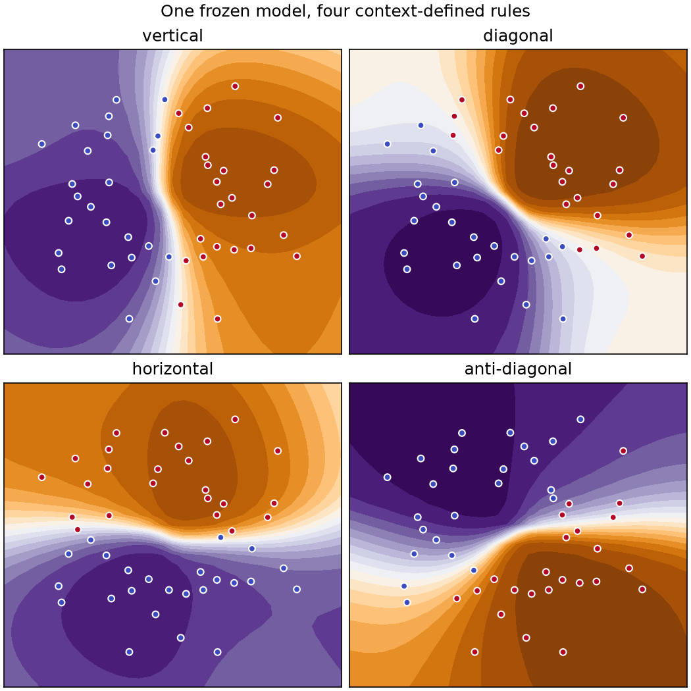
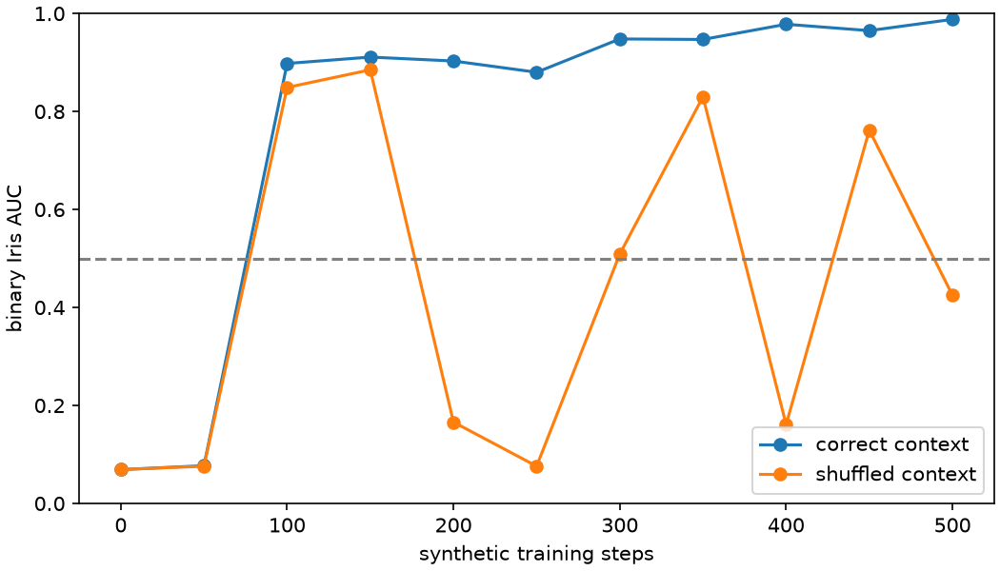

# microTabICLv2

A **285-line**, one-file implementation of
[TabICLv2](https://arxiv.org/abs/2602.11139) for learning. It trains from
scratch on a Mac and runs the same file with a larger model on Modal.

Like [microTabPFN](https://github.com/jxucoder/microtabpfn), this is a readable
experiment—not the official pretrained model or its compute budget.

## Run everything

Install [uv](https://docs.astral.sh/uv/), then:

```bash
uv sync --extra dev
uv run python microtabiclv2.py --steps 500 --device auto
```

That trains synthetic tasks, evaluates binary Iris every 50 steps, tests
context switching, and regenerates both figures below. `auto` chooses CUDA,
Apple MPS, then CPU.

## Read one file

Open [`microtabiclv2.py`](microtabiclv2.py) and read downward:

1. `prior` creates many small classification tasks.
2. `Attention` adds QASSMax-style context and query scaling.
3. `MicroTabICLv2` performs column, row, then in-context attention.
4. `train` learns across synthetic tasks.
5. `iris_auc`, `rule_auc`, and `plot_proof` test what it learned.
6. `modal_train` runs the larger configuration on a cloud GPU.

The whole script is 285 lines, including comments, evaluation, plots, Modal,
and the CLI. The actual prior and model occupy roughly half of it. There is no
package tree, configuration framework, trainer abstraction, or custom plotting
code.

```text
features + known train labels
             │
             ▼
 induced attention down each column
             │
             ▼
 attention across columns in each row
             │
             ▼
 test rows attend to labeled train rows
             │
             ▼
        class probabilities
```

## Proof that context matters

One frozen model receives the same coordinates but four different sets of
context labels. Its decision boundary follows the examples without gradient
updates:



The raw training trace compares correct context with shuffled-label context:



One 500-step Apple MPS run with seed 42 produced:

| Intervention | AUC |
|---|---:|
| Binary Iris, correct context | **0.988** |
| Binary Iris, shuffled labels | 0.425 |
| 100 changing rules, correct context | **0.971** |
| Same tasks, wrong rule | 0.487 |
| Same tasks, shuffled labels | 0.485 |

The controlled gap is the evidence: model weights and test inputs stay fixed;
only the labeled examples change. Exact values vary with hardware and seed.

## Make it bigger with Modal

The `big` configuration increases width, inducing tokens, and attention depth.
The same source file exposes one Modal function:

```bash
uv sync --extra modal
uv run modal setup
uv run modal run --detach microtabiclv2.py::modal_train --steps 10000
```

It uses an L40S/A10 fallback pool and stores `big.pt` in the persistent
`microtabiclv2-checkpoints` Volume.

## Deliberate omissions

- classification only;
- a tiny nonlinear prior instead of the full released prior;
- no RoPE, preprocessing ensemble, KV cache, or disk offloading;
- contexts of tens of rows, not the paper's 60K-row curriculum;
- no claim of matching TabICLv2 benchmark results.

The implementation was checked against the
[paper](https://arxiv.org/abs/2602.11139), the
[official repository](https://github.com/soda-inria/tabicl), its public v2
pretraining/prior changes in PR #135, and
[NanoTabICL](https://github.com/soda-inria/nanotabicl).

## Check it

```bash
uv run ruff check .
uv run pytest
uv build
```

The wheel contains one Python module. The repository keeps one 16-line test
file; generated checkpoints, caches, and build artifacts are ignored.

## License

BSD 3-Clause. TabICLv2 is by Qu, Holzmüller, Varoquaux, and Le Morvan.
